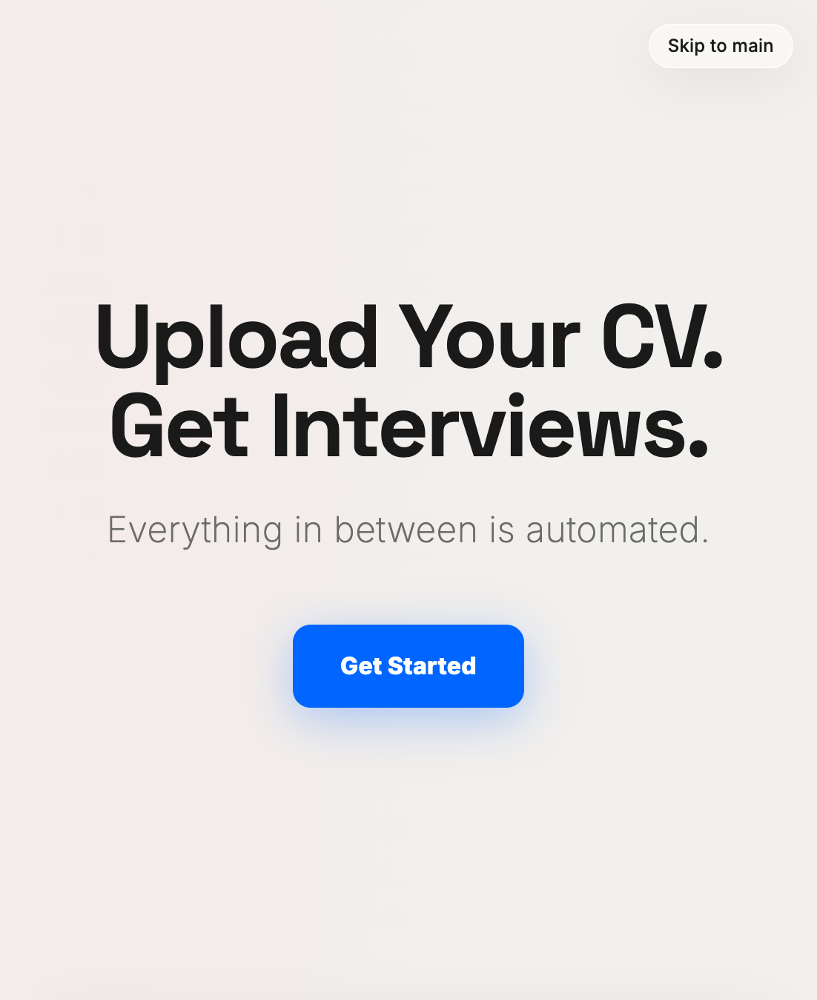

# AutoApply



## What it does

AutoApply is built for students and new grads who need to apply at high volume without living inside forms and spreadsheets. You upload your CV once, complete a short onboarding profile, and the product is designed to carry the workload from there: surfacing roles, tailoring materials, tracking submissions, and keeping interviews organized.

The experience centers on a single promise: **upload your résumé, get interviews**. The messy middle (research, customization, follow-ups, and status tracking) is handled as a coordinated workflow instead of a pile of one-off tabs.

## Why it’s better

Most tools only solve a slice of the problem. Auto-fill helpers often reuse one generic résumé. Tailoring tools may stop at the document. Trackers log what you did manually but don’t apply for you. AutoApply is aimed at **closing more of the loop**: per-role résumé emphasis and ATS-aware wording, signals for low-quality or “ghost” listings, referral path hints from your network, and interview-stage automation (prep, thank-yous, follow-ups) so momentum doesn’t die after you click submit.

You get **visibility** (what’s queued, what’s live, what scored well) without pretending the hard parts are magic. You stay in control while the system does the repetitive work.

## Features

- One-time CV upload with structured parsing and an editable profile from onboarding
- Onboarding questionnaire, résumé template selection, and optional hooks for LinkedIn connections, calendar, and Google Sheets
- Continuous job discovery from aggregated listing sources, with fit scoring and profile matching
- Per-job tailored résumés and cover letters driven by the job description, plus custom short-answer generation from your profile and essay bank
- ATS detection, form fill and submission via browser automation, with manual handoff when a portal cannot be completed automatically
- Recruiter outreach when contacts are available, plus automated classification of inbound replies (rejections, interview requests, info asks) to keep the tracker current
- **Live application feed** on the home screen: timestamped events per company and role, expandable detail for resumes, letters, ATS context, and form artifacts
- **Jobs board** with filters (source, company, role type, location, scores) and cards showing fit score, competition estimate, ghost flag, timing urgency, referral badge, and status
- **Application tracker** table: company, role, dates, method, resume and cover letter links, ATS score, status, responses, and a smart **next action** column
- **Resume vault** storing every generated resume so you can see what was emphasized for each application
- **ATS score preview** before submit: keyword match, gaps, parsability, with automatic revision cycles when scores fall below threshold
- **Ghost job detection** scoring listings from posting age, repeats, link health, and company signals, with clear flags and reasoning
- **Application timing intelligence** using historical close rates so fast-filling roles get urgency labels and queue priority
- **Referral network mining** against LinkedIn connections: surfaces paths into target companies and supports referral-first outreach before auto-apply
- **Interview loop**: calendar-aware scheduling support, prep materials, post-interview thank-you drafts, and timed follow-ups when replies stall
- Optional **Google Sheets** sync mirroring the tracker for power users who want spreadsheet workflows
- **Settings** for auto-apply thresholds, daily limits, template and profile editing, essay bank management, and integration toggles

## Running locally

```bash
npm install
npm run dev
```

Then open the URL Vite prints (usually `http://localhost:5173`). Use **Skip to main** in the corner of the landing page to open the dashboard without signing in.
